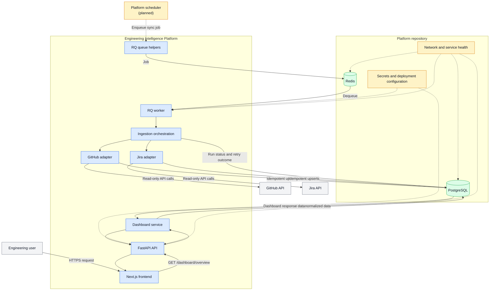

# System Architecture

## Purpose

The Engineering Intelligence Platform collects delivery data from engineering
systems, normalizes it into a common data model, and serves an aggregated
dashboard. Provider-specific payloads stay inside integration adapters and do
not cross the backend API boundary.

## Tech Stack

| Area | Technology | Responsibility and rationale |
| --- | --- | --- |
| Frontend | Next.js, React, TypeScript, Tailwind CSS | Renders the dashboard with type-safe API data and predictable server-side loading. |
| API | FastAPI, Python | Provides REST endpoints, validation, dependency injection, and clear error responses. |
| Data access | SQLAlchemy, Alembic | Provides typed persistence and versioned database migrations. |
| Database | PostgreSQL | Stores normalized, durable application data and supports relational aggregation. |
| Vector search | pgvector (planned) | Keeps future embeddings close to application data without adding a separate database. |
| Queue | Redis and RQ | Holds asynchronous ingestion jobs and lets workers run independently of API requests. |
| Testing | pytest, Ruff, Vitest, Playwright | Covers backend behavior, frontend components, and end-to-end browser behavior. |
| AI gateway | LiteLLM (planned) | Provides one provider-independent interface for future AI capabilities. |

## Infrastructure

Infrastructure is owned by the separate `platform` repository. It provides
PostgreSQL, Redis, networking, secrets, and service deployment. This
repository owns application code and configuration only.

The backend uses:

- **PostgreSQL** as the system of record for organizations, normalized
  delivery data, and ingestion history.
- **Redis** as transient queue infrastructure. It is not used for dashboard
  records or credentials.
- **RQ workers** to consume Redis jobs and execute GitHub/Jira synchronization
  outside request processing.

The current worker is started with `python -m app.worker`. Scheduling,
health checks, scaling, and production restart policies belong in the platform
deployment.

## Integrations

### GitHub

The GitHub adapter uses read-only API access to retrieve repositories, pull
requests, and Actions workflow runs. It maps provider identifiers and fields
to `Repository`, `PullRequest`, and `Build`.

Development uses a fine-grained personal access token. Production should use a
GitHub App with explicit installation and repository scope.

### Jira

The Jira adapter uses read-only API access for configured project keys. It
retrieves issues, epics, and versions/releases, then maps them to `Issue`,
`Epic`, and `Release`.

Jira risk and release completion are calculated during normalization when Jira
does not provide a directly usable value. Development uses a service-account
API token; production should use OAuth or centrally managed credentials.

### Integration rules

- Credentials are supplied through environment configuration and are never
  stored in normalized tables.
- Synchronization is organization-scoped and idempotent.
- Provider failures are classified explicitly; transient failures are retried
  with a bounded attempt count.
- `IngestionRun` records the outcome without storing raw provider payloads.

## Components and Relationships



The solid arrows represent runtime data flow. Dashed arrows represent
platform-provided configuration or planned scheduling. The platform repository
owns the boundary shown in yellow; this repository owns the application
components shown in blue.

### Component responsibilities

| Component | Responsibility |
| --- | --- |
| Frontend | Requests the dashboard contract and renders loading, error, empty, and data states. |
| FastAPI API | Defines the public application contract, validates inputs/outputs, and maps failures to HTTP responses. |
| Dashboard service | Aggregates normalized records into dashboard KPIs, rankings, releases, and epics. |
| Provider client | Handles authentication, HTTP requests, pagination, and provider-specific response parsing. |
| Sync service | Converts provider models into normalized entities, applies organization scope, and performs idempotent upserts. |
| Ingestion orchestration | Creates run records, applies retry policy, and records success or failure. |
| RQ worker | Executes queued synchronization jobs without blocking API requests. |
| PostgreSQL | Persists the normalized model and operational history. |
| Redis | Delivers queued jobs from producers to workers. |

## Request and Response Flow

### Dashboard request

1. The frontend requests `GET /dashboard/overview`.
2. FastAPI resolves the configured dashboard organization.
3. `DashboardService` queries normalized PostgreSQL records.
4. The service calculates KPIs, repository rankings, release progress, and
   delayed epics.
5. FastAPI validates and returns the stable dashboard response contract.
6. The frontend renders the response without knowing whether the source was
   GitHub, Jira, or another provider.

### Ingestion request

1. A CLI command, scheduler, or future API producer enqueues a provider job.
2. RQ stores the job in platform-managed Redis.
3. An RQ worker executes the existing synchronization entrypoint.
4. The sync service fetches provider data and performs idempotent PostgreSQL
   upserts.
5. `IngestionRun` is updated with status, attempts, timestamps, count, and any
   sanitized error.
6. The dashboard reads the updated normalized records.

## Database Design

The database uses normalized tables with UUID primary keys, audit timestamps,
foreign keys, provider identifiers, and organization scoping.

| Entity | Purpose |
| --- | --- |
| `Organization` | Owns dashboard data and integration scope. |
| `User` | Stores the current dashboard profile and future identity data. |
| `Repository` | Normalized GitHub repository. |
| `PullRequest` | Normalized pull request linked to a repository. |
| `Build` | Normalized GitHub Actions workflow run linked to a repository. |
| `Issue` | Normalized Jira issue. |
| `Epic` | Normalized Jira epic with delay and risk. |
| `Release` | Normalized Jira version with status and completion. |
| `IngestionRun` | Durable synchronization status and retry history. |

External provider IDs are used for idempotent upserts. Raw provider responses,
access tokens, and secrets are not stored in these tables.

The application currently defaults to the `public` PostgreSQL schema to
preserve deployed data. Moving to the planned `platform` schema requires a
separate migration and rollback rehearsal.

## Directory Structure

```text
eng-intelligence-platform/
├── backend/
│   ├── app/
│   │   ├── api/             # FastAPI routes
│   │   ├── core/            # Settings and logging
│   │   ├── db/              # SQLAlchemy session and base
│   │   ├── integrations/   # GitHub and Jira clients/sync services
│   │   ├── models/         # Persistence models
│   │   ├── schemas/         # API response schemas
│   │   ├── services/       # Dashboard and ingestion orchestration
│   │   ├── queue.py         # RQ queue helpers
│   │   ├── worker.py        # RQ worker entrypoint
│   │   ├── sync_github.py   # GitHub CLI entrypoint
│   │   └── sync_jira.py     # Jira CLI entrypoint
│   ├── migrations/          # Alembic migrations
│   └── tests/               # Backend tests
├── frontend/
│   ├── app/                 # Next.js routes and page
│   ├── components/          # Dashboard and UI components
│   ├── lib/                 # API client and frontend types
│   └── e2e/                 # Playwright tests
├── docs/                    # Product, API, database, and architecture docs
└── .github/                 # Repository instructions and automation
```

Platform deployment files and infrastructure services are maintained in the
separate `platform` repository.
